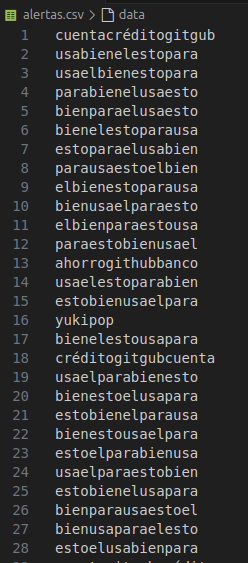

# Scraping de Dominios Recientemente Registrados

Este proyecto es un script en Python para realizar scraping de dominios recientemente registrados desde el sitio web ABT Domain. Los resultados se almacenan en un archivo CSV para facilitar su análisis posterior. Actualmente, el scraping se realiza solo para dominios .com, pero se planean mejoras para soportar todos los gTLDs.

- 
- 
- 
- 
- 
  
## Características

- Obtiene dominios registrados recientemente a partir de una fecha específica.
- Soporta rangos de fechas personalizados para el scraping.
- Guarda los dominios encontrados en un archivo CSV con la fecha de registro y el nombre del dominio.
- Nuevo: Incluye la funcionalidad de alertas para buscar dominios que contengan palabras o frases específicas.
- Permite la permutación de palabras clave para generar alertas y realizar búsquedas detalladas.

## Requisitos

- Python 3.7 o superior
- Las siguientes librerías de Python:
  - requests
  - beautifulsoup4
  - csv
  - datetime
  - os
  - prettytable
  - itertools

Puedes instalarlas usando pip:

```
pip install requests beautifulsoup4 prettytable
```

## Uso

### Clonar el Repositorio

Clona este repositorio para obtener el script en tu máquina local:

```
git clone [URL_DEL_REPOSITORIO]
```

### Ejecutar el Script Principal

Ejecuta el script `scraper_dominios_registrados.py` en Python para obtener los dominios:

```
python scraper_dominios_registrados.py
```

### Seleccionar el Rango de Fechas

Al iniciar el script, se te pedirá seleccionar el rango de fechas para realizar el scraping:

1. Hoy: Obtiene los dominios registrados en el día actual.
2. Última Semana: Obtiene los dominios registrados durante la última semana.
3. Últimos 15 Días: Obtiene los dominios registrados durante los últimos 15 días.
4. Personalizado: Introduce manualmente la fecha de inicio y la fecha de fin.

### Alertas y Permutaciones

Puedes utilizar el script `alerts.py` para agregar palabras o frases que servirán como alertas. Estas palabras se permutarán para generar combinaciones adicionales que puedan encontrarse en los dominios registrados.

Ejemplo: Si ingresas la frase "Cuenta ahorro senior banco github", el script generará permutaciones como:

- "Cuentaahorroseniorbancogithub"
- "ahorroCuentaseniorbancogithub"
- "seniorahorroCuentagithubbanco"
- "githubbancoseniorahorroCuenta"
- ...y muchas más combinaciones posibles.

## Alertas

Después de realizar el scraping, usa el script `posibles.py` para buscar dominios que coincidan con las palabras clave establecidas en las alertas. Esto incluye tanto palabras sueltas como frases. Además, puedes cargar tu propio archivo CSV para evitar ingresar las alertas por consola.

## Resultados

Los resultados del scraping se almacenarán en un archivo llamado `dominios_registrados.csv` que incluye dos columnas: Fecha y Dominio. Los dominios coincidentes con las alertas se guardarán en un archivo separado `resultados.csv`.

## Funciones del Script

### `obtener_dominios_por_fecha(fecha_str)`

Obtiene todos los dominios registrados en una fecha específica desde el sitio web indicado.

- Parámetros: `fecha_str` (str) - Fecha en formato AAAA-MM-DD.
- Retorna: Lista de dominios encontrados.

### `scrapear_dominios(fecha_inicio, fecha_fin)`

Realiza el scraping para el rango de fechas especificado y guarda los resultados en un archivo CSV.

- Parámetros: `fecha_inicio` y `fecha_fin` (datetime).

### `obtener_rango_fechas()`

Solicita al usuario que seleccione el rango de fechas para el scraping.

- Retorna: `fecha_inicio`, `fecha_fin` (datetime).

## Manejo de Errores

- El script detecta errores comunes como problemas de conexión, elementos HTML faltantes, o interrupciones del usuario (tecla Ctrl + C).
- Si el script no puede acceder a una página, muestra el código de estado HTTP y detiene el scraping de esa fecha.

## Advertencia

Este script es solo para propósitos educativos. Asegúrate de cumplir con las leyes y políticas de uso del sitio web antes de hacer scraping. No uses este script para actividades maliciosas o sin el permiso del propietario del sitio web.

## Contribuciones

Las contribuciones son bienvenidas. Si deseas mejorar este proyecto, por favor realiza un fork del repositorio, realiza tus cambios y abre un Pull Request.

## Licencia

Este proyecto está bajo la licencia MIT. Consulta el archivo LICENSE para más información.

## Mejoras Futuras

- Añadir soporte para scraping de todos los gTLDs, no solo .com.
- Permitir búsquedas específicas por terminación de gTLD.
- Implementar una interfaz gráfica para la visualización de los datos obtenidos.
